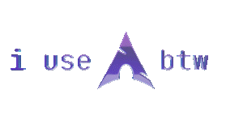

# Aakarsh Kashyap
---
C, C++, and questionable life choices.
---
bootable OS. tensor engine. unix shell. the usual.

GPU memory, kernel panics, and occasionally sleep.

---
> "Clean > Clever > Bloat"

[LinkedIn](https://linkedin.com/in/souls-syntax)

---

---

