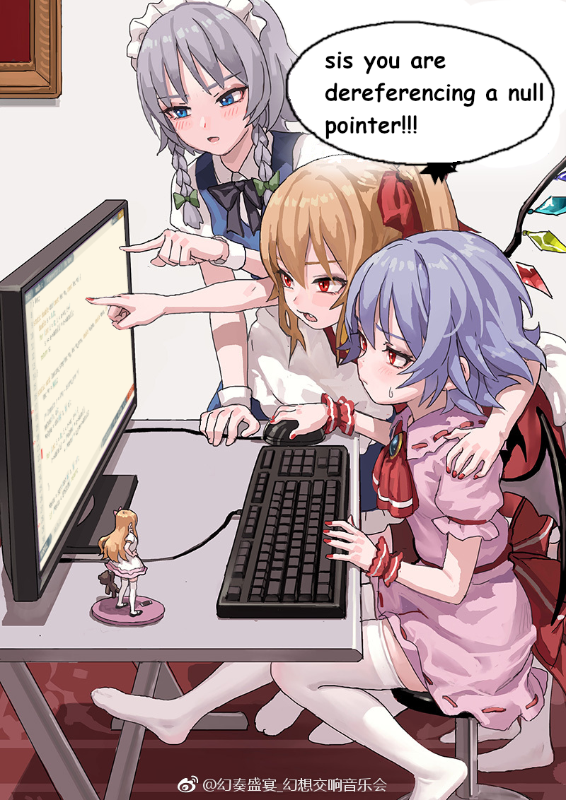
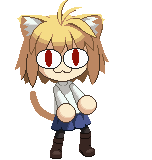
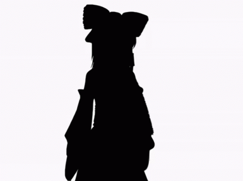

# Aakarsh Kashyap

C, C++, and questionable life choices.

Aspires to make softwares that suck less.

bootable OS. tensor engine. unix shell. the usual.
GPU memory, kernel panics, and occasionally sleep.

> "Anthropomorphizing your projects is the best way to go about it"

> "My cute sakura-chan(text editor) supports her big sis rin-chan(interpreted language)"

---

 

---

 
 

**Server I maintain** : ![[server]](https://discord.gg/tW7MkkCMQ7)

